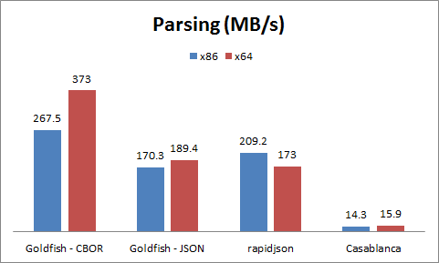

# GoldFish
## A fast JSON and CBOR streaming library, without using memory

## Why GoldFish?
GoldFish can parse and generate very large [JSON](http://json.org) or [CBOR](http://cbor.io) documents.
It has some similarities to a [SAX](https://en.wikipedia.org/wiki/Simple_API_for_XML) parser, but doesn't use an event driven API, instead the user of the GoldFish interface is in control.
GoldFish intends to be the easiest and one of the fastest JSON and CBOR streaming parser and serializer to use.

## Quick tutorial
### Converting a JSON stream to a CBOR stream
```cpp
#include <goldfish/json_reader.h>
#include <goldfish/cbor_writer.h>

int main()
{
	using namespace goldfish;

	// Read the string literal as a stream and parse it as a JSON document
	// This doesn't really do any work, the stream will be read as we parse the document
	auto document = json::read(stream::read_string_non_owning("{\"A\":[1,2,3],\"B\":true}"));

	// Generate a stream on a vector, a CBOR writer around that stream and write
	// the JSON document to it
	// Note that all the streams need to be flushed to ensure that there any potentially
	// buffered data is serialized.
	auto cbor_document = cbor::create_writer(stream::vector_writer{}).write(document);
	assert(cbor_document == std::vector<byte>{
		0xbf,                    // start map
		0x61,0x41,               // key: "A"
		0x9f,0x01,0x02,0x03,0xff,// value : [1, 2, 3]
		0x61,0x42,               // key : "B"
		0xf5,                    // value : true
		0xff                     // end map
	});
}
```

### Parsing a JSON document with a schema
SAX parsers are notoriously more complicated to use than DOM parser. The order of the fields in a JSON object matters for a SAX parser.
Defining a schema (which is simply an ordering of the expected key names in the object) helps keep the code simple.
Note that the example below is O(1) in memory (meaning the amount of memory used does not depend on the size of the document)

```cpp
#include <goldfish/json_reader.h>

int main()
{
	using namespace goldfish;

	auto document = json::read(stream::read_string_literal("{\"a\":1,\"c\":3.0}")).as_map("a", "b", "c");
	assert(document.read_value("a")->as_uint() == 1);
	assert(document.read_value("b") == nullopt);
	assert(document.read_value("c")->as_double() == 3.0);
	seek_to_end(document);
}
```

How about a more complicated example. Note again that this program doesn't allocate memory to parse the document and could run on very large documents backed by file (using `stream::file_reader`) or other type of stream even on resource constrained machines.

```cpp
#include <goldfish/json_reader.h>
#include <iostream>

int main()
{
	using namespace goldfish;

	auto document = json::read(stream::read_string_literal(
		R"([
			{"name":"Alice","friends":["Bob","Charlie"]},
			{"name":"Bob","friends":["Alice"]}
		])")).as_array();

	while (auto entry_document = document.read())
	{
		auto entry = entry_document->as_map("name", "friends");
		std::cout << entry.read_value("name").value().as_string() << " has the following friends: ";

		auto friends = entry.read_value("friends").value().as_array();
		while (auto friend_name = friends.read())
			std::cout << friend_name->as_string() << " ";

		std::cout << "\n";
		seek_to_end(entry);
	}

	/*
	This program outputs:
		Alice has the following friends: Bob Charlie
		Bob has the following friends: Alice
	*/
}
```

### Generating a JSON or CBOR document
You can get a JSON or CBOR writer by calling json::create_writer or cbor::create_writer on an output stream.

```cpp
#include <goldfish/json_writer.h>

int main()
{
	using namespace goldfish;
	
	auto map = json::create_writer(stream::string_writer{}).start_map();
	map.write("A", 1);
	map.write("B", "text");
	map.write("C", stream::read_string_literal("Hello world!"));

	// Streams are serialized as binary 64 data in JSON
	test(map.flush() == "{\"A\":1,\"B\":\"text\",\"C\":\"SGVsbG8gd29ybGQh\"}");
}
```

Note how similar the code is to generate a CBOR document. The only change is the creation of the writer (cbor::create_writer instead of json::create_writer) and the type of output_stream (vector<byte> is better suited to storing the binary data than std::string).
CBOR leads to some significant reduction in document size (the document above is 41 bytes in JSON but only 27 in CBOR format). Because CBOR supports binary data natively, there is also performance benefits (no need to encode the data in base64).

```cpp
#include <goldfish/cbor_writer.h>

int main()
{
	using namespace goldfish;

	auto map = cbor::create_writer(stream::vector_writer{}).start_map();
	map.write("A", 1);
	map.write("B", "text");
	map.write("C", stream::read_string_literal("Hello world!"));

	test(map.flush() == std::vector<byte>{
		0xbf,                               // start map marker
		0x61,0x41,                          // key: "A"
		0x01,                               // value : uint 1
		0x61,0x42,                          // key : "B"
		0x64,0x74,0x65,0x78,0x74,           // value : "text"
		0x61,0x43,                          // key : "C"
		0x4c,0x48,0x65,0x6c,0x6c,0x6f,0x20,
		0x77,0x6f,0x72,0x6c,0x64,0x21,      // value : binary blob "Hello world!"
		0xff                                // end of map
	});
}
```

## Comparison with other libraries
Let's look at the performance of various libraries when doing a rather stupid task: computing the sum of all the integers in a large JSON document.
This test was compiled using Visual C++ 2015,  ran on an Intel Core i7 CPU, both in 32 and 64 bits, on a 16MB JSON document. The document was converted in CBOR using the Goldfish library, which leads a slightly smaller document (around 14MB).
The chart below shows the performance of the 3 libraries, in MB of JSON per second (so 16MB divided by time to do the job, even for CBOR). The rapidjson implementation uses the SAX version of the library.
Higher is better:

 

Goldfish is slightly slower than rapidjson in 32 bit mode but slightly faster than rapidjson in 64 bit mode.
Both libraries are significantly faster than Casablanca, simply because Casablance only offers a DOM interface and couldn't do the job in streaming mode.

## Documentation
### Streams
Goldfish parses documents from read streams and serializes documents to write streams.

Goldfish comes with a few readers: a reader over an in memory buffer (see `stream::read_buffer_ref`) or over a file (see `stream::file_reader`). It also provides a buffering (see `stream::buffer`). You might find yourself in a position where you want to implement your own stream, for example, as a network stream on top of your favorite network library.
Not to worry, the interface for a read stream is fairly straightforward, with a single read_buffer API:
```cpp
struct read_stream
{
	// Copies some bytes from the stream to the "buffer"
	// Returns the number of bytes copied.
	// If the API returns something else than buffer.size(), the end of stream was reached.
	// read_buffer can still be called after the end is reached, in that case it returns 0
	//
	// buffer_ref is an object that contains a pointer to the buffer (buffer.data() is the pointer)
	// as well as the number of bytes in the buffer (buffer.size())
	size_t read_buffer(buffer_ref buffer);
}
```

Write streams have the following interface:
```cpp
struct write_stream
{
	// Write some data to the stream
	void write_buffer(const_buffer_ref data);

	// Finish writing to the stream
	// This API must be called once the end of stream is reached
	// It may return some data. For example, a vector_writer returns/
	// the data written to the stream (in the form of an std::vector<byte>)
	auto flush();
}
```

There are a few helper APIs that you can use to ease the consumption of streams:
```cpp
// Seek forward in the stream up to cb bytes
// This API returns the number of bytes skipped from the stream, which can be less
// than cb if the end of the stream is reached
// It is implemented in terms of read_buffer, unless the reader_stream has a seek
//  method on it (in which case that method is used)
uint64_t stream::seek(reader_stream&, uint64_t cb);

// Read the entire stream in memory
std::vector<byte> stream::read_all(reader_stream&);
std::string stream::read_all_as_string(reader_stream&);

// Read an object of type T from the stream
// The object must be a POD
// This API is implemented in terms of read_buffer, unless the reader_stream has a
// read method on it (in which case that method is used)
// If the end of stream is reached before sizeof(T) bytes could be read, this method
// throws unexpected_end_of_stream
template <class T> T stream::read(reader_stream&);

// Write an object of type T to the stream
// The object must be a POD
// This API is implemented in terms of write_buffer, unless the writer_stream has a
// write method on it (in which case that method is used)
template <class T> void stream::write(writer_stream&, const T&);
```

Here is the exhaustive list of readers provided by the library:
* `stream::ref_reader<reader_stream>` (created using `stream::ref(reader_stream&)`): copyable stream that stores a non owning reference to an existing stream
* `stream::const_buffer_ref_reader` (created using `stream::read_buffer_ref` or `stream::read_string_non_owning`): a stream that reads a buffer, without owning that buffer
* `stream::base64_reader<reader_stream>` (created using `stream::decode_base64(reader_stream)`): convert a base64 stream into a binary stream
* `stream::buffered_reader<N, reader_stream>` (created using `stream::buffer<N>(reader_stream)`): add an N byte buffer to the reader_stream
* `stream::file_reader`: a reader stream on a file

Note that those streams can be composed. For example, `stream::decode_base64(stream::buffer<8192>(stream::file_reader("foo.txt")))` opens the file "foo.txt", buffers that stream using an 8kB buffer and decodes the content of the file assuming it is base64 encoded.

Here is the list of writers provided by the library:
* `stream::ref_writer<writer_stream>` (created using `stream::ref(writer_stream&)`): copyable stream that stores a non owning reference to an existing stream
* `stream::vector_writer`: stores the data in memory, in an std::vector<byte>
* `stream::string_writer`: stores the data in memory, in an std::string
* `stream::base64_writer<writer_stream>` (created using `stream::encode_base64_to(writer_stream)`): data written to that stream is base64 encoded before being written to the writer_stream
* `stream::buffered_writer<N, writer_stream>` (created using `stream::buffer<N>(writer_stream)`): add an N byte buffer to the writer_stream
* `stream::file_writer`: a writer stream on a file
